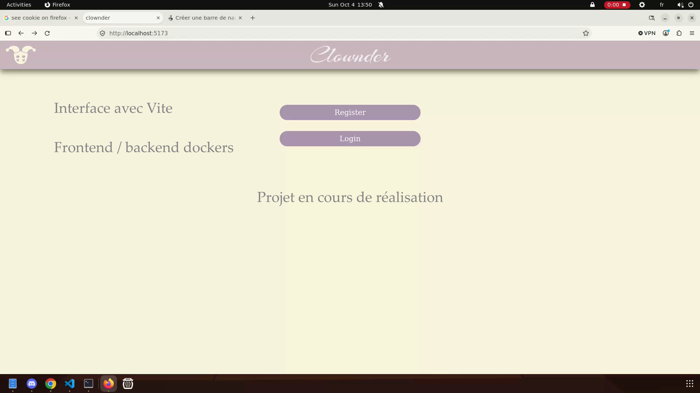

🚧 **Work in Progress** 🚧
 *Certified clown-free*

<!--  -->

🔗 [GitHub / Code](https://github.com/pswirgie/matcha)

Clownder is a dating web application designed to help potential partners connect, covering the entire user journey, from sign-up to meeting in person.

👥 **Developed in collaboration with [AgarOther](https://github.com/AgarOther)**.  
This is a **specialization project** (named Matcha by default), which I started proactively during the 42 common core.

#### My contributions:
- Login / authentication
- Cookies
- Password security (hashing)
- Styling (CSS)

*We worked closely together and carefully peer-reviewed each other's code, so that we both understand the entire codebase.*

#### Current progress ✅
- [X] Project setup with **Vite**
- [X] Clean frontend/backend separation with **Docker**
- [X] **SQLite** database integration
- [X] User **registration** flow
- [X] **Login / authentication** (Cookie / Token)
- [X] Email verification
- [X] Logout
- [X] Password reset
- [X] Password security (hashing with bcrypt)
- [X] Search bar

#### Next steps 🚧

- [ ] Matching algorithm
- [ ] Fame rating
- [ ] Browsing with filters/sorting

The current state of development is shown below and updated as features are completed.

|Languages| Front-end | Back-end | Database| Tools |
|---------|-----------|----------|---------|--------|
||    |   | |   |